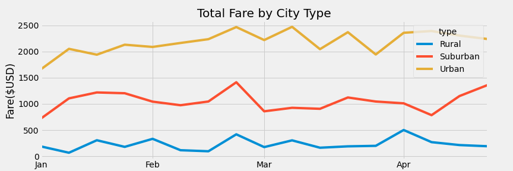

# PyBer_Analysis by Ketaki
## Overview
This project summarizes the Py-Ber data for the user by city type using Pandas and Python(Matplotlib library). There are three city types in the given dataset - **Rural, Urban and Suburban.**
- The first part of the project summarizes the data by city type in a DataFrame comprising of the total number of rides, total number of drivers, total fares, average fare by ride and average fare by driver. This is achieved using the grouby(), sum() and count() functions.
- The second part plots a multi-line graph that shows the total weekly fares for each city type. This is achieved using the pivot() and resample() functions of Pandas.
- We then highlight the diferences in data for each city type that can be used to make strategic decisions by the Py-Ber team.
## Results
From the summary table below, we can find that:

- Urban cities have more number of rides than the other two city types, more than twice than Suburban cities and thirteen times higher than Rural cities. 
- Urban cities have more number of drivers than the other two city types. Suburban comes second and Rural third. The driver count in the urban cities is almost 5 times to that of Suburban cities and 30 times to that of Rural cities. More drivers are employed by Py-Ber in Urban cities than other two.
- Urban cities have the highest total fares than the other two city types. The total fares in Urban cities is twice the total fares in the Suburban cities and nine times the total fares in the Rural cities. 
- However, in terms of 'average fare per ride', Rural cities comes first with the highest average fare per ride, followed by Suburban and then the Urban cities. The difference however is not very high and is approximately in the range of (~$4 - $6) between the three city types.
- The Average fare per Driver is the highest in Rural cities, followed by Suburban and the least in Urban cities. The Average fare per Driver in Rural cities is three times higher than that in Urban cities and around 1.4 times than Suburban cities.
- From the multi-line graph below, we find that the 'total weekly fares' is highest in Urban cities, followed by Suburban cities and least in Rural cities.

## Summary
- The results of the total number of rides,total number of drivers and total fares by city type show us that there is a lot of demand for Py-Ber rides in the Urban cities than Rural or Suburban cities. Hence, more revenue(~63%) comes from Urban cities. **Hence, this sector should be maintained well and any improvements or new rollouts must be send out to Urban cities first**.
- We can however find that **the number of drivers in the Urban cities is higher than the number of rides.** This means that some of the drivers are not getting enough Business(rides). **This is also reflected in the Average fare per Driver values which is the lowest for Urban cities, where there is more supply(drivers) than demand(rides).**  **This makes this sector less profitable. These Urban city drivers can instead be useful in the other two city types where is more demand for drivers.**
- The Average fare per ride is the highest in the Rural cities which might be because the price of a ride is higher because of more demand and less supply(**surge pricing**). This surge pricing  might be a deterrent for residents in Rural cities(and likeise in Suburban cities) and a factor for the lower number of rides in the Rural cities.  **Increasing the number of drivers in Rural and/or in Suburban cities** can help overcome this.
- Suburban cities seem to be doing good Business in terms of getting rides and fares.

